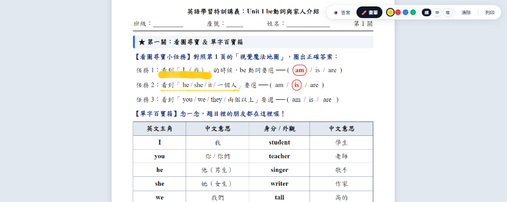

# Interactive Lesson Worksheet (雙模式教學互動學習單)

> 專為各科教師打造的備課革命：**「講義即簡報」**。  
> 一份 HTML 檔案，同時搞定**學生 A4 紙本純淨測驗卷**與**課堂大屏／投影互動教學**。



---

## 💡 為什麼需要這個工具？（設計理念）

### 1. 徹底解放教師：再也不需要為了上課重做 PPT
以前老師出完學習單或考卷，為了上課講解，往往還得大費周章把題目一題題複製貼上做成簡報。  
現在**「講義本身就是最好的簡報」**！備課只需產生一份 HTML，上課直接投放到大螢幕、電子白板或投影機，省下無數熬夜做簡報的時間。

### 2. 視線零時差：學生學習極度直觀，不再迷航
很多時候簡報的排版、字型和學生桌上的紙本完全不同，學生常在「抬頭看簡報」與「低頭找題目」之間迷失，特別對學習障礙或容易分心的學生是沉重負擔。  
這套方案讓**投影螢幕與桌上講義 100% 完全同步**，行距、字級、結構完全一致，學生跟課直觀輕鬆、學習成效立竿見影！

---

## ✨ 核心特色

### 🖨️ 學生紙本列印模式（A4 Print）
- **格式 100% 穩定**：相容標準 A4 邊距，跨頁自動乾淨分頁，徹底告別傳統 Word 跨平台跑版的惡夢。
- **一鍵純淨輸出**：按下列印（或 `Ctrl + P`）時，智慧樣式會**自動過濾所有解答、工具列與筆跡**，還原為無解答的標準白紙作業／試卷。
- **零干擾提示**：卷面上絕無「點題目秀答案」等操作提示字眼，保證學生看到的卷面最乾淨、專業。

### 🖥️ 課堂大屏／投影教學模式（Classroom Presentation）
- **逐題點擊秀答案**：不論使用**電子白板、大屏觸控、平板手寫或普通滑鼠**，手點或點擊題目任意處，解答即以「紅筆手繪圈選／填入」樣式即時顯現，講解節奏完全由老師掌控。
- **一鍵全開答案**：工具列提供「👁️ 答案」切換鍵，集體對答案或課堂總結時一秒全卷揭曉。
- **多功能懸浮螢光筆工具**：
  - 🟡 **螢光黃**：劃記重點文字，半透明不遮擋字母。
  - 🔴 **紅色**：重點訂正、錯誤圈記。
  - 🔵 **藍色**：文法結構／主角劃記。
  - 🟢 **綠色**：關鍵補充筆記。
  - 提供 **細（4px）、中（10px）、粗（20px）** 三段筆觸，並支援一鍵清除畫記。

### 📐 特教友善與低認知負荷排版（Universal Design）
- 採用最舒適好讀的中英文印刷字體（英文 `Times New Roman`、中文 `標楷體`）。
- 內文字級鎖定清晰 **14pt**，遠距離投影清晰不吃力。
- 選擇題括弧固定對齊、選項垂直堆疊，連連看題型內建 SVG 平滑連線，大幅降低學生視覺混亂。

---

## 📁 專案結構

```text
interactive-lesson-worksheet/
├── SKILL.md                  # Antigravity 專用 Skill（貼上教材自動排版產出）
├── README.md                 # 專案說明文件
├── assets/
│   └── preview.png           # 教學現場操作預覽圖
├── resources/
│   └── template.html         # 通用講義 HTML/CSS/JS 完整模板（開箱即用）
└── examples/
    └── reference_example.html # 國中英語 5 頁完整示範講義
```

---

## 🚀 使用方式

1. **一鍵安裝 Skill**：
   複製本專案網址，直接對您的 AI 助手（如 Antigravity）說：
   > **「請幫我安裝這個 skill：https://github.com/chuoneone/interactive-lesson-worksheet」**

2. **開始備課**：
   將任何備課資料（國文、英文、數學、自然、社會等題庫、講義或筆記）傳給 AI：
   > *「這是我這週的備課資料，請幫我製作成雙模式互動講義。」*  
   AI 便會自動套用規範，生成兼具 A4 純淨列印與大屏互動的 HTML 講義！

---

## 📄 授權條款
MIT License
